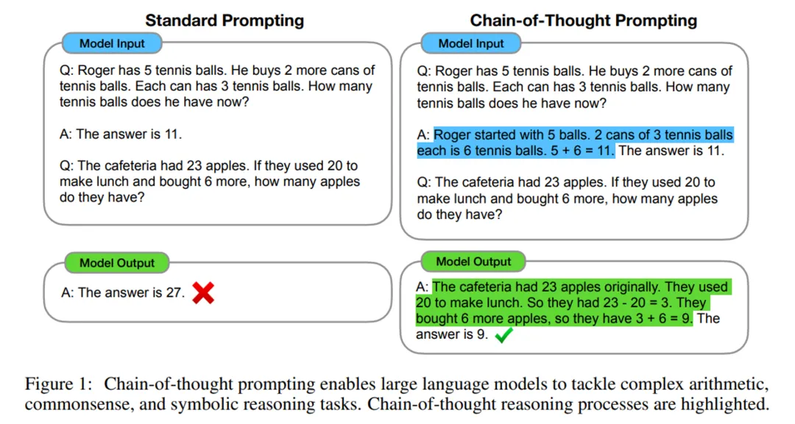
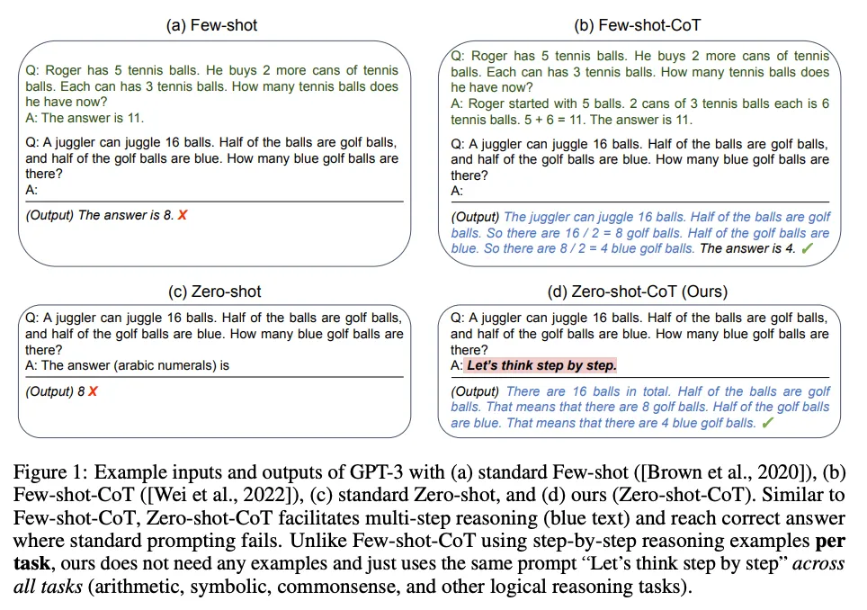
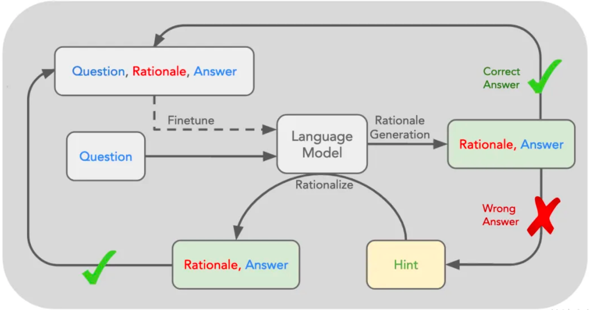
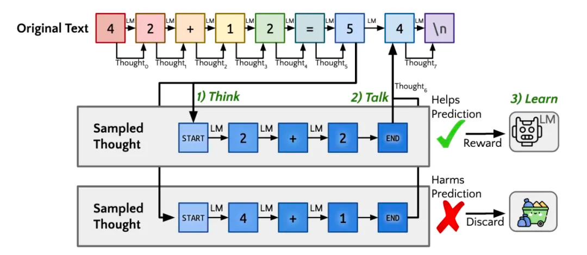

[🤖 Learning AI](README.md) / 概念释义

# 概念释义

## CoT

CoT：Chain of Thought，思维链。CoT 是学者们发现的能够激发大模型通过“思考”来回答困难问题的技术，可以显著提高其在推理等任务上的正确率。

1. 手工在 Prompt 中加入一些包含思维过程，引导模型思考的信息，可以帮助 LLM 在推理任务的表现上得到大幅提升。

2. 提示 LLM 一步一步地思考，引导大模型分步思维。

## RL

RL：Reinforcement Learning，强化学习。强化学习是机器学习的一种方法，用于训练智能体（agent）在与环境的交互中学习如何做出决策。

STaR：Selff-Taught Reasoner，自学推理。STaR 方法：先给模型一些例题详细解法，再让模型学着去解更多的题，如果做对就把方法再补充到例题里，形成数据集，对原模型微调，让模型学会这些方法，这也是一种经典的自动生成数据的方法。

Quiet-STaR(Q*)：安静的自学推理。核心为在每个输入 token 之后插入一个"思考"步骤，让大模型生成内部推理。然后，系统会评估这些推理是否有助于预测后续文本，并相应地调整模型参数。这种方法允许模型在处理各种文本时都能进行隐含的推理，而不仅仅是在回答问题时。

但这种自学习机制，由于奖励模型的复杂，所以通常仅在数学和代码领域表现较好。

OpenAI 披露：更多的强化学习（训练时计算）和更多的思考时间（推理时计算），使得 o1 模型的性能可以持续提高。

---
[« 提示工程](Prompt.md)

[» 神经网络](神经网络.md)
