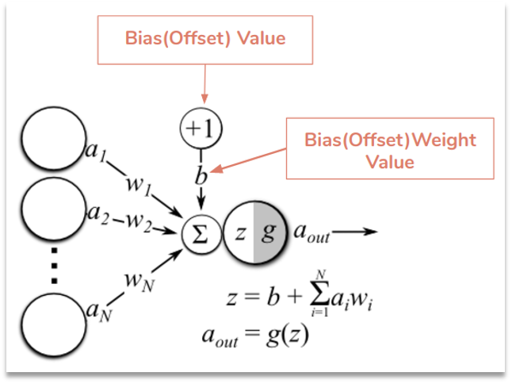

[🤖 Learning AI](README.md) / 神经网络

# 神经网络

- 任何事务都能被数字化
- 任何复杂的函数都可以被神经网络表达，哪怕没有显示解析式

## 基本原理

### 神经元概念

- 权重(Weight)
  
  权重是神经元用来衡量输入信号重要性的参数。权重越大，表示输入信号对神经元的影响越大。

- 偏置(Bias)
  
  偏置是一个常数项，用来调整神经元的输出。它的作用是让神经元在没有输入时也能输出一个基础的值。

  偏置可以帮助神经元更容易地被激活或者抑制。

- 激活函数(Active Action)
  
  激活函数是神经元用来决定是否将输入信号传递给下一层神经元的函数的“开关”，它将神经元的加权输入（权重x输入+偏置）转换成一个非线性输出。

  激活函数的作用是引入非线性因素，使神经网络能够拟合任意复杂的函数。

### 神经网络概念

- 梯度

- 反向函数

> 参考：<https://nnplayground.com/>

---
[« 概念释义](概念释义.md)
